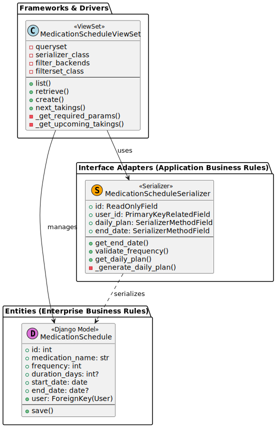
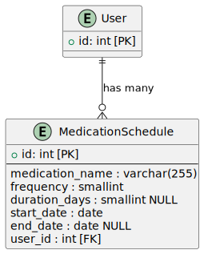

# Class diagram


# ER diagram


## Instalation

1. Clone the repository:
   ```bash
   git clone https://github.com/507015T/doctor-aibolit.git
   ```
2. Navigate to the project directory:
   ```bash
   cd doctor-aibolit
   ```
   ```
4. Build project(with docker)
    ```bash
    sudo docker build -t doctor-aibolit .
    ```
5. Run project
    ```bash
    sudo docker run -p 8000:8000 doctor-aibolit
    ```


## Configuration

Set the following environment variables:

- for development use and add (if you need) environment variables in the .env.dev file

## Testing
Tests will start with the build project(item 4)
